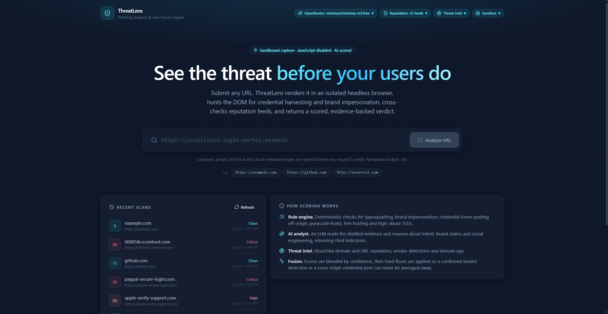

# ThreatLens

An AI-powered web threat detection and phishing analysis platform. Submit a URL and
ThreatLens renders it inside a locked-down headless browser, extracts the DOM,
forms and links, runs five independent analysis engines over the result, and
returns a fused 0-100 threat score with per-finding evidence.

Built as a full stack: FastAPI + Playwright backend, Next.js analyst dashboard,
Postgres for scan history, all orchestrated with Docker Compose.

---

## Screenshot



The analyst dashboard: submit a URL for analysis, watch the active engines
(reputation feeds, threat intel, sandbox, AI provider) light up as badges, and
review recent scans with their threat scores and verdicts.

---

## How it works

A scan runs through five engines. Each contributes weighted risk factors; a
fusion step reconciles them into one score.

| Engine | Source tag | What it does |
|---|---|---|
| **Reputation** | `reputation` | Checks the host against a curated blocklist and phishing-morphology regexes, plus an allowlist of major brands. Runs **before** the browser, so known-bad domains get a verdict in ~0ms even if they no longer resolve. |
| **Sandbox** | `network` | Playwright/Chromium with JavaScript disabled, strict timeouts, a full-page screenshot, and DOM/form/link extraction. Sub-resource requests to private IP ranges are aborted mid-flight. |
| **Heuristics** | `heuristic` | Deterministic rules over the URL and DOM: typosquatting and homoglyphs, credential-harvesting forms, cross-origin form actions, brand impersonation, punycode, shared-hosting abuse, missing TLS, security-header gaps. |
| **AI analyst** | `ai` | An LLM reads the DOM excerpt, form structure and link graph under a strict system prompt and returns structured JSON: indicators, category, confidence, reasoning. |
| **Threat intel** | `threat_intel` | VirusTotal v3 domain and URL reputation lookups over `httpx`. |

The reputation engine deliberately runs first. Phishing sites get taken down
fast, and a domain that no longer resolves would otherwise fail the fetch and
return no verdict at all. A reputation hit short-circuits the pipeline.

The allowlist is a damper, not a bypass. It caps the ceiling only when no
critical findings exist, so a genuinely compromised trusted host can still be
flagged.

### Scoring bands

| Score | Risk level |
|---|---|
| 85-100 | `critical` |
| 65-84 | `high` |
| 40-64 | `medium` |
| 20-39 | `low` |
| 0-19 | `safe` |

---

## Quickstart

Requires Docker Desktop (or Docker Engine + Compose v2). Nothing else — no local
Python, Node, or Postgres.

```bash
git clone https://github.com/An4rchistt/threatlens.git
cd threatlens
cp .env.example .env
docker compose up --build
```

Then open:

- Dashboard: http://localhost:3000
- API: http://localhost:8000
- OpenAPI docs: http://localhost:8000/docs

First build pulls the Playwright base image and installs Chromium, so expect a
few minutes. Subsequent builds are cached.

**It runs with no API keys at all.** The reputation, sandbox and heuristic
engines are fully functional keyless; the AI and threat-intel engines report
themselves as disabled in the dashboard until you add credentials.

---

## Configuration

Everything lives in `.env`. See `.env.example` for the annotated full list.

### AI provider

Pick one and set only its key. Any OpenAI-compatible endpoint works, because the
analyzer builds a `ChatOpenAI` client against a configurable `base_url`.

| `AI_PROVIDER` | Cost | Key from |
|---|---|---|
| `groq` | Free, no card | https://console.groq.com/keys |
| `gemini` | Free tier | https://aistudio.google.com/apikey |
| `openrouter` | Free `:free` model catalogue | https://openrouter.ai/keys |
| `ollama` | Free, fully local, no key | `docker compose --profile local-ai up` |
| `openai` | Paid | https://platform.openai.com/api-keys |
| `custom` | — | Set `AI_BASE_URL` + `AI_API_KEY` |

```env
AI_PROVIDER=groq
GROQ_API_KEY=your_key_here
AI_MAX_TOKENS=4096
```

Leave `AI_PROVIDER` empty to auto-detect from whichever key has a value.

`AI_MAX_TOKENS` matters more than it looks: reasoning models spend output tokens
thinking before emitting content, so a tight budget returns an empty completion
rather than a short one. 4096 is a safe floor.

For a fully local, keyless setup:

```bash
docker compose --profile local-ai up --build
docker compose exec ollama ollama pull llama3.2
# then set AI_PROVIDER=ollama and restart the backend
```

### Threat intel

```env
VIRUSTOTAL_API_KEY=your_key_here
```

Free community keys allow roughly 4 lookups/minute and 500/day. Leave empty to
skip threat-intel entirely.

### API authentication

```env
API_KEY=tl_your_generated_secret
```

When set, `POST /api/scan`, `GET /api/scans` and `GET /api/scans/{id}` all
require a matching `X-API-Key` header. `GET /api/health` and `GET /api/config`
stay open, because the container healthcheck and the dashboard's engine badges
need them pre-auth.

Generate one with:

```bash
python -c "import secrets; print('tl_' + secrets.token_urlsafe(32))"
```

Two caveats worth understanding:

1. **Changing `API_KEY` requires rebuilding the frontend**, not just restarting
   it. The value is passed as the `NEXT_PUBLIC_API_KEY` build arg and inlined
   into the browser bundle at build time.
2. **Anything in a browser bundle is public.** This stops other machines and
   bots from burning your API credits. It is *not* user authentication. For a
   real public deployment, proxy `/api/*` through a server-side route and keep
   the secret server-side.

Leaving `API_KEY` empty leaves the API unauthenticated. The backend logs a
warning at startup when this is the case.

---

## API

### `POST /api/scan`

```bash
curl -X POST http://localhost:8000/api/scan \
  -H "Content-Type: application/json" \
  -H "X-API-Key: $API_KEY" \
  -d '{"url": "https://example.com"}'
```

Request:

| Field | Default | Description |
|---|---|---|
| `url` | required | Absolute http(s) URL |
| `include_screenshot` | `true` | Return a base64 full-page screenshot |
| `deep_analysis` | `true` | Run the LLM pass |
| `check_threat_intel` | `true` | Query VirusTotal |

The response includes `threat_score`, `risk_level`, `verdict`, `summary`,
`recommended_action`, a `risk_factors[]` array (each with severity, source,
confidence, weight and evidence), a `score_breakdown`, per-engine `ai_analysis` /
`virustotal` / `reputation` sub-reports, the screenshot, response headers, a
`security_headers` map, extracted `forms[]` and `links[]`, a `dom_excerpt`, and
an `engines` status block.

### Other endpoints

| Endpoint | Auth | Purpose |
|---|---|---|
| `GET /api/scans?limit=20&offset=0` | required | Paginated history (no screenshots or DOM) |
| `GET /api/scans/{scan_id}` | required | Full stored report |
| `GET /api/config` | open | Which engines are enabled, feed sizes, limits |
| `GET /api/health` | open | Liveness, DB connectivity and latency, browser readiness |

Note that Swagger's "Try it out" does not attach the `X-API-Key` header, so it
returns 401 once auth is enabled. Use `curl` for authenticated testing.

---

## Measured accuracy

There is a labeled evaluation harness rather than an asserted number:

```bash
docker compose exec backend python -m eval.accuracy
```

On the bundled 50-URL dataset (25 malicious, 25 benign):

```
TP=25  TN=25  FP=0  FN=0
accuracy=100%  precision=100%  recall=100%
```

**Read that honestly.** The harness is deterministic and offline — it exercises
only the pre-fetch path (reputation plus URL heuristics), makes no network calls,
and runs against a dataset in this repo. It proves the scoring logic separates
the labeled classes cleanly with zero false positives. It is **not** a claim of
100% accuracy on the live internet.

Real-world behaviour splits in two:

- **Known threats and pattern matches**: near-certain, instant, no network needed.
- **Novel phishing with an unmatched hostname**: depends on the live heuristics,
  the AI pass and VirusTotal. Good, not perfect.

The single biggest real-world accuracy improvement is pointing
`REPUTATION_FEED_PATH` and `REPUTATION_ALLOWLIST_PATH` at live feeds refreshed on
a schedule (OpenPhish, PhishTank, URLhaus). The bundled `domains` entries are
illustrative phishing morphology, not a live-scraped blocklist — the *patterns*
are what generalise. See `backend/data/README.md` for the schema.

---

## Security posture

The scanner fetches attacker-controlled URLs, which makes it an SSRF engine if
built carelessly. Defences actually implemented:

- **URL validation as the first gate**, before any resolution: scheme allowlist,
  port allowlist, length cap.
- **Post-resolution IP filtering**: loopback, private ranges, link-local,
  cloud-metadata endpoints (`169.254.169.254`), and encoded/decimal IP forms are
  all rejected.
- **NAT64 handling**: `64:ff9b::/96` addresses are decoded to their embedded
  IPv4 and re-checked, rather than blanket-blocked. Docker's DNS64 returns this
  prefix for every public host, so blanket-blocking breaks all real scanning.
  This check must run before the generic reserved-range test, since Python marks
  the prefix reserved.
- **JavaScript disabled** in the browser context.
- **Per-request sub-resource filtering** — the page cannot pivot to internal
  hosts mid-render.
- **Container hardening**: non-root user, `cap_drop: ALL`,
  `no-new-privileges`, `init: true` to reap crashed Chromium children, Postgres
  on an `internal: true` network with no host port published.
- **Rate limiting** and per-request IDs on every response.

One documented tradeoff: `SCRAPER_NO_SANDBOX=1` is the default because
Chromium's setuid sandbox cannot start in a container with all capabilities
dropped. The compensating controls above are what make that acceptable. Set it
to `0` if you instead run the container with `SYS_ADMIN`.

---

## Project layout

```
backend/
  main.py            FastAPI app, endpoint handlers, engine orchestration, fusion
  models.py          SQLAlchemy ScanHistory + all Pydantic schemas + SSRF validation
  scraper.py         Playwright sandbox: render, screenshot, extract DOM/forms/links
  analyzer.py        LangChain LLM analyst + provider registry + VirusTotal client
  reputation.py      Blocklist/allowlist/pattern engine
  database.py        Engine, session factory, health probe
  data/              threat_feed.json, allowlist.json (+ schema docs)
  eval/              Labeled dataset and accuracy scorer
frontend/
  pages/index.tsx    The entire analyst dashboard
  styles/            Tailwind global styles
docker-compose.yml   postgres + backend + frontend (+ optional ollama profile)
```

---

## Known limitations

Honest list, roughly by impact:

- **Next.js is pinned at 14.2.5, which has a published security advisory.** Not
  yet upgraded.
- **No TLS.** Everything is plain HTTP; terminate TLS at a reverse proxy before
  exposing this.
- **The Postgres password defaults to a dev value** in `.env.example`. Change it.
- **Frontend API key is client-visible** by design, as explained above.
- **The rate limiter is in-process**, so it breaks with multiple workers or
  replicas. Needs Redis for horizontal scaling.
- **Screenshots are stored in Postgres with no retention policy**, so the
  database grows unbounded.
- **`ENABLE_DOCS=1` by default** exposes the OpenAPI schema.
- **No CI pipeline**, and no unit test suite beyond the accuracy harness.
- **The reputation feed is seed data**, not a live subscription.

This runs reliably as a local analysis tool and a demonstration of the
architecture. Treat the list above as the gap between that and a production
deployment.

---

## Stack

Python 3.11, FastAPI 0.109, Pydantic 2.6, SQLAlchemy 2.0, Playwright 1.40,
LangChain 0.1, httpx, Postgres 16, Next.js 14, React 18, Tailwind CSS,
TanStack Query, Axios, Lucide icons. All backend dependencies are fully pinned;
the `playwright` pin must match the base image tag.

## License

Released under the [MIT License](LICENSE).
